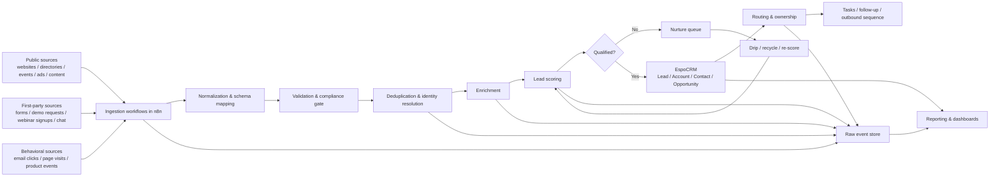
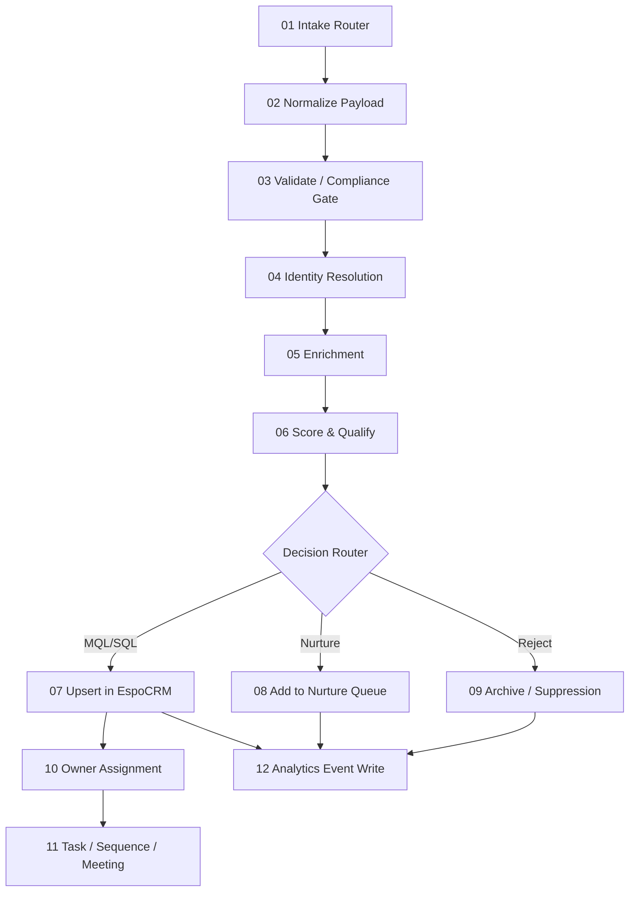
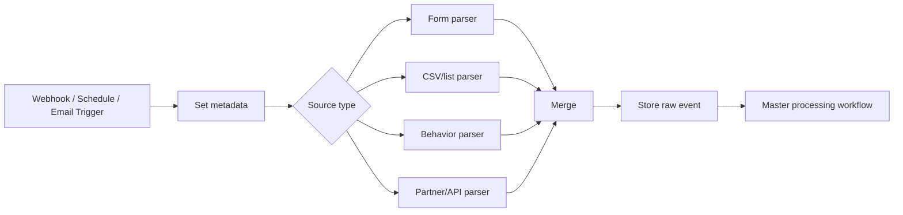
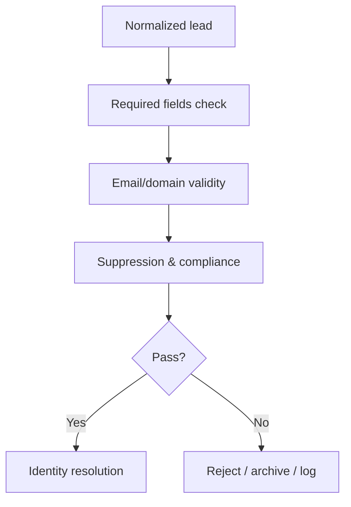
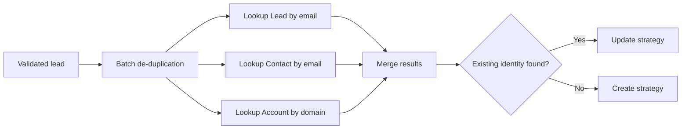
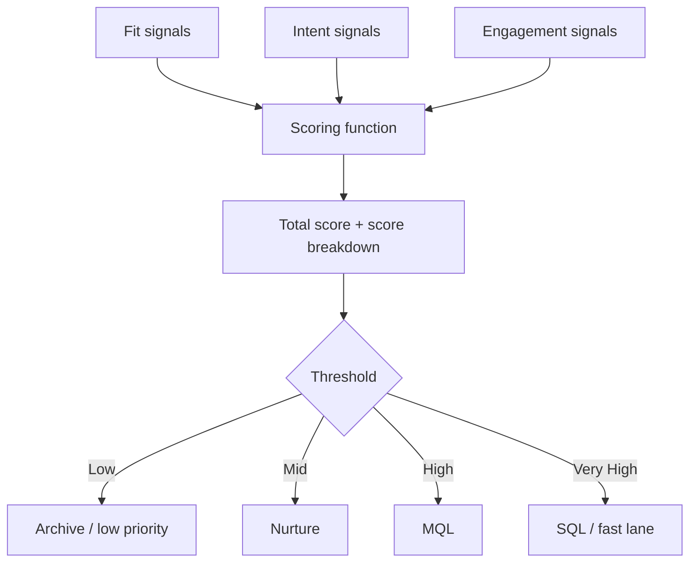
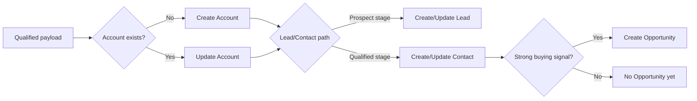
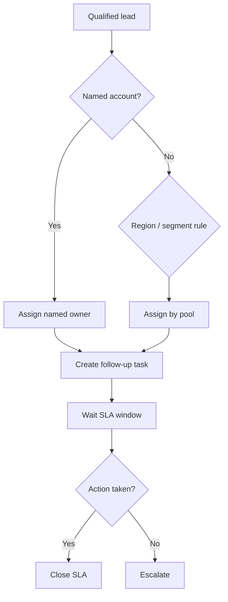
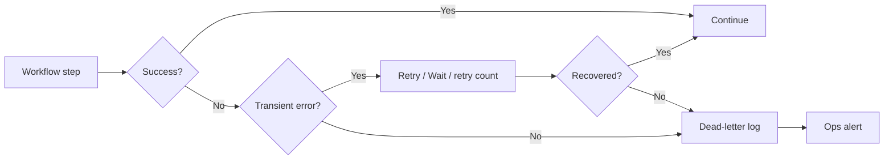
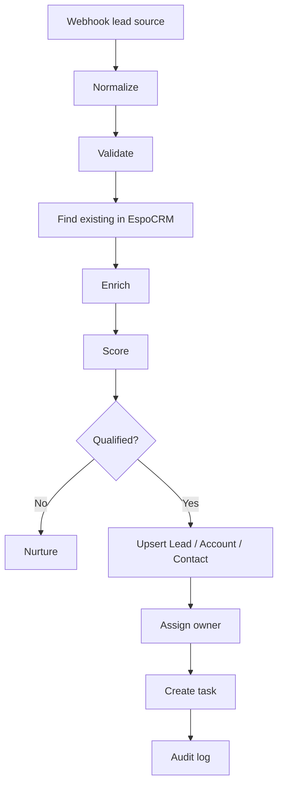

# n8n-LEAD-GEN

# EspoCRM + n8n Lead Generation Workflow Blueprint

## Project Summary

This document outlines the design for a multi-source lead engine. n8n handles the orchestration — collection, validation, enrichment, scoring, routing, nurture, and CRM sync. EspoCRM acts as the system of record for Leads, Contacts, Accounts, Opportunities, Tasks, and Campaigns.

A few notes on the stack choice. EspoCRM is a self-hosted CRM, open source under AGPLv3, with a full REST API. n8n is a workflow automation platform that gives us webhooks, schedules, branching, HTTP calls, deduping, loops, and sub-workflows. n8n's self-hosted community edition runs under its Sustainable Use License rather than a standard OSI open-source license, which is worth flagging but has not been a blocker for internal deployments.

---

## 1. Target Architecture



---

## 2. Core Systems and Their Role

### EspoCRM

- Master record for Lead, Contact, Account, Opportunity
- Stage and lifecycle management
- Ownership and the sales work queue
- Task records and follow-up visibility
- Campaign and source attribution
- API-accessible CRM storage

### n8n

- Receives data from webhooks, schedules, feeds, and APIs
- Normalizes payloads into one canonical schema
- Dedupes and merges records before any CRM write
- Calls enrichment providers and custom data sources
- Computes lead score and lifecycle stage
- Assigns owner and creates the next-step task
- Triggers outbound and nurture workflows
- Writes audit and reporting events

### Supporting Components

- **Postgres** for raw event logs, scoring history, audit trails, and idempotency keys
- **Redis** for queueing and rate control if volume gets heavy
- **S3-compatible storage** for imported CSVs and attachments
- **Email delivery provider** for nurture and outbound
- **Reverse proxy with TLS** for secure webhook and API exposure

---

## 3. EspoCRM Data Model — First Setup Task

The following entities and custom fields need to be created or verified inside EspoCRM before any workflow is wired up.

### Standard Entities

- Lead
- Contact
- Account
- Opportunity
- Task
- Campaign

### Custom Fields on Lead

`leadSourceDetail`, `sourceCampaignId`, `sourceChannel`, `sourceMedium`, `sourceUrl`, `jobTitle`, `companyDomain`, `employeeRange`, `industry`, `geoRegion`, `linkedinUrl`, `fitScore`, `intentScore`, `engagementScore`, `totalScore`, `qualificationStatus`, `qualificationReason`, `ownerPool`, `dedupeKey`, `enrichmentStatus`, `consentStatus`, `lastSignalAt`, `lastNurtureAt`

### Custom Fields on Account

`domain`, `employeeRange`, `industry`, `techStack`, `annualRevenueBand`, `targetTier`, `territory`, `accountFitScore`

### Custom Fields on Contact

`linkedinUrl`, `seniority`, `department`, `persona`, `contactFitScore`, `engagementLevel`

---

## 4. Canonical Lead Schema in n8n

Every workflow maps incoming data into this shape before any logic branches. This is non-negotiable — it is what keeps the whole pipeline sane.

```json
{
  "leadId": "internal_uuid",
  "sourceType": "form|csv|web|directory|ad|event|behavioral",
  "sourceName": "linkedin_ads",
  "sourceCampaignId": "cmp_123",
  "timestamp": "2026-04-23T12:00:00Z",
  "person": {
    "firstName": "",
    "lastName": "",
    "fullName": "",
    "email": "",
    "phone": "",
    "jobTitle": "",
    "linkedinUrl": ""
  },
  "company": {
    "name": "",
    "domain": "",
    "industry": "",
    "employeeRange": "",
    "country": "",
    "city": ""
  },
  "signals": {
    "pricingPageViews": 0,
    "webinarAttended": false,
    "emailClicks": 0,
    "formIntent": "high",
    "productTrial": false
  },
  "compliance": {
    "consentStatus": "unknown",
    "suppressed": false,
    "jurisdiction": "EU"
  }
}
```

---

## 5. Build Order from Scratch

### Phase 1 — Platform Setup

**Step 1: Install EspoCRM**

- Application server
- Database
- Admin user
- API enabled
- Custom fields configured
- Sales pipelines and stages configured

**Step 2: Install n8n**

- n8n server
- Credentials store
- Environment variables and secrets
- Timezone configured
- Error workflow enabled
- Separate folders, tags, and projects for workflows

**Step 3: Shared Support Services**

- Postgres database for event and audit storage
- Email provider credentials
- Slack or Teams notifications (optional)
- Enrichment API credentials (optional)

---

## 6. Master Workflow Map



---

## 7. n8n Workflows and the Components Each Needs

### Workflow A — Lead Intake Router

Purpose: catch leads from every channel and hand them off to one unified process.

**Triggers**

- **Webhook** for website forms, ad leads, partner referrals, chat submissions
- **Schedule Trigger** for directory scraping imports, list refreshes, periodic pull jobs
- **Email Trigger (IMAP)** for inbound lead emails or forwarded event lists
- **Manual Trigger** for testing and replay
- **RSS Feed Trigger** for content, event, or news sourcing where relevant

**Node chain**

1. Webhook / Schedule Trigger / Email Trigger
2. Edit Fields (Set) — adds `sourceType`, `sourceName`, `receivedAt`, `traceId`
3. Switch — routes by source type
4. Execute Sub-workflow — each source goes to its own parser
5. Merge — rejoins normalized items
6. HTTP Request or Postgres — stores the raw inbound event
7. Execute Sub-workflow — hands off to the master processing workflow

**Why this shape**

Webhook covers real-time inbound. Schedule Trigger covers crawls, imports, and refreshes. Switch keeps source-specific parsing logic isolated. Execute Sub-workflow keeps things modular. Merge brings the stream back together.



---

### Workflow B — Normalize Payload

Purpose: force every source into the same lead schema.

**Components**

1. Edit Fields (Set) — rename incoming keys
2. Rename Keys — standardize inconsistent field names
3. Code — nested transformations and derived values
4. If — check minimum required fields
5. Stop And Error — reject malformed input

**Logic highlights**

- Map `full_name` or `contactName` into `person.fullName`
- Split `fullName` into first and last via a Code node where needed
- Lowercase email and company domain
- Parse UTM parameters into source fields
- Infer company domain from the email domain when the company site is missing

---

### Workflow C — Validation and Compliance Gate

Purpose: kill bad, incomplete, risky, or disallowed leads before enrichment or any CRM write.

**Components**

1. If — email format, business domain, mandatory fields
2. Code — free-email-domain checks, country logic, suppression logic
3. HTTP Request — query suppression list or internal compliance service
4. Switch — allowed / nurture / reject
5. Postgres — log the rejection reason

**Checks**

- Missing email and missing company domain
- Fake, test, or spam values
- Suppressed domain or address
- Outside target geography
- Forbidden persona types
- Duplicate raw submission inside a short window



---

### Workflow D — Identity Resolution and Deduplication

Purpose: decide if a lead is new, an existing lead, an existing contact, or tied to an existing account.

**Components**

1. Edit Fields (Set) — calculate dedupe keys
2. Remove Duplicates — strip dupes inside the current batch
3. HTTP Request — search EspoCRM Leads by email
4. HTTP Request — search EspoCRM Contacts by email
5. HTTP Request — search EspoCRM Accounts by domain
6. Merge — combine the lookup results
7. If — branch create vs update
8. Code — choose the winning identity and merge strategy

**Dedupe keys**

- Primary: normalized email
- Secondary: company domain + full name
- Tertiary: LinkedIn URL
- Account key: normalized company domain

**Merge policy**

- Never overwrite manually edited owner fields blindly
- Trust the newest source for campaign metadata
- Trust the enrichment provider for firmographic fields only above the confidence threshold
- Keep full history in the audit log — not just the latest values



---

### Workflow E — Enrichment

Purpose: fill in missing company and contact data before scoring.

**Components**

1. If — only enrich when actually needed
2. HTTP Request — enrichment provider or custom endpoint
3. Wait — handle API pacing
4. Code — normalize the enrichment output
5. Merge — combine raw and enriched payload
6. Postgres — save the enrichment snapshot

**Typical enrichments**

Company size, industry, domain verification, social and profile URLs, location, seniority and persona, technology stack.

**Guardrails**

- Enrichment failure does not block the flow
- `enrichmentStatus = partial` when some fields fail to resolve
- Retry only on rate limits and transient failures

---

### Workflow F — Scoring and Qualification Engine

Purpose: turn fit, intent, and engagement into a lifecycle stage.

**Components**

1. Code — calculate the score
2. If — threshold checks
3. Switch — classify as Reject, Nurture, MQL, SQL, or Opportunity-ready
4. Edit Fields (Set) — write score breakdown and reason
5. Postgres — save scoring version history

**Scoring model**

*Fit score*

- Target industry: +15
- Company size in band: +10
- Target region: +10
- Target persona or title: +20
- Free email: -20

*Intent score*

- Demo request: +40
- Pricing page visit: +15
- Webinar attendance: +20
- Downloaded asset: +10

*Engagement score*

- Opened email: +5
- Clicked email: +10
- Replied positively: +30
- Booked a meeting: +50

*Thresholds*

- Below 20: reject or low-priority archive
- 20 to 49: nurture
- 50 to 79: MQL
- 80 and above: SQL or direct sales route



---

### Workflow G — EspoCRM Upsert

Purpose: get qualified records into EspoCRM correctly.

**Components**

1. HTTP Request — create or update Lead
2. HTTP Request — create or update Account when a company domain is present
3. HTTP Request — create or update Contact when the contact is qualified or meeting-ready
4. HTTP Request — create an Opportunity for hand-raisers
5. Merge — collect the EspoCRM record IDs
6. If — create vs update path
7. Stop And Error — fail loudly when a CRM write goes wrong

**Upsert order**

1. Account
2. Lead or Contact
3. Link records
4. Opportunity (if applicable)
5. Task creation

**Write rules**

- Most inbound or sourced prospects land as a Lead
- Convert or create Contact plus Account once qualification is strong
- Opportunity only when there is a sales-accepted buying signal



---

### Workflow H — Owner Assignment and SLA

Purpose: route the lead to the right rep and enforce response time.

**Components**

1. Switch — branch by territory, segment, account tier, source type
2. Code — round-robin calculation or named-account override
3. HTTP Request — update owner in EspoCRM
4. HTTP Request — create a Task in EspoCRM
5. Wait — hold for the SLA duration
6. HTTP Request — check whether the task was completed or the stage advanced
7. If — escalate or close
8. Send Email or HTTP Request to a chat tool — notify managers on breach

**Assignment rules**

- Named account owner wins
- Otherwise region and segment mapping
- Otherwise round-robin pool
- Fast-lane leads get immediate task priority



---

### Workflow I — Nurture and Recycle

Purpose: keep mid-score leads warm and pull them back in when their signals improve.

**Components**

1. Switch — choose the nurture track
2. Send Email or provider API via HTTP Request
3. Wait — time delay between steps
4. HTTP Request — fetch engagement events
5. Code — rescore
6. If — promote to sales once the threshold is reached
7. Loop Over Items — process batches of nurture candidates

**Tracks**

- Early research persona
- Wrong timing
- Event follow-up
- Content-only engagement
- Dormant and recycled leads

---

### Workflow J — Analytics and Audit

Purpose: full observability and reporting.

**Components**

1. Postgres — raw event, enriched event, score event, CRM write log
2. Code — calculate metrics snapshots
3. Schedule Trigger — hourly or nightly reporting jobs
4. HTTP Request — export EspoCRM deltas where needed
5. Send Email or chat notifications — anomaly alerts

**Tables**

`raw_lead_events`, `canonical_leads`, `enrichment_snapshots`, `score_history`, `crm_write_log`, `assignment_log`, `nurture_events`, `suppression_log`

---

## 8. Sub-workflows to Create

Each of these lives as a separate n8n workflow and gets called with **Execute Sub-workflow**:

- `wf_parse_form_source`
- `wf_parse_csv_source`
- `wf_parse_behavior_source`
- `wf_validate_lead`
- `wf_resolve_identity`
- `wf_enrich_lead`
- `wf_score_lead`
- `wf_upsert_espocrm`
- `wf_assign_owner`
- `wf_nurture_lead`
- `wf_log_audit`

This keeps the system complex under the hood but genuinely manageable day-to-day.

---

## 9. Node-by-Node Build Sequence

### Build 1: Inbound form workflow

1. Webhook
2. Set — source metadata
3. Rename Keys
4. Code — normalize email, domain, full name
5. If — required fields present
6. Execute Sub-workflow `wf_validate_lead`
7. Execute Sub-workflow `wf_resolve_identity`
8. Execute Sub-workflow `wf_enrich_lead`
9. Execute Sub-workflow `wf_score_lead`
10. Switch — reject / nurture / qualified
11. Execute Sub-workflow `wf_upsert_espocrm`
12. Execute Sub-workflow `wf_assign_owner`
13. Send Email — inbound confirmation
14. Execute Sub-workflow `wf_log_audit`
15. Respond to Webhook

### Build 2: Scheduled outbound sourcing workflow

1. Schedule Trigger
2. HTTP Request — pull a public dataset or internal list API
3. Split Out — one company or contact candidate per item
4. Code — map to canonical schema
5. If — ICP pre-filter
6. Loop Over Items
7. Execute Sub-workflow `wf_validate_lead`
8. Execute Sub-workflow `wf_resolve_identity`
9. Execute Sub-workflow `wf_enrich_lead`
10. Execute Sub-workflow `wf_score_lead`
11. Switch — ignore / nurture / CRM
12. Execute Sub-workflow `wf_upsert_espocrm`
13. Execute Sub-workflow `wf_log_audit`

### Build 3: SLA escalation workflow

1. Schedule Trigger
2. HTTP Request — fetch open follow-up tasks from EspoCRM
3. Loop Over Items
4. If — overdue
5. Send Email or notify channel
6. HTTP Request — update task priority or create an escalation task
7. Execute Sub-workflow `wf_log_audit`

---

## 10. EspoCRM API Interaction Pattern

n8n **HTTP Request** nodes hit the EspoCRM REST API for:

- Search Lead by email
- Search Contact by email
- Search Account by domain
- Create or update Lead
- Create or update Contact
- Create or update Account
- Create Opportunity
- Create Task
- Update owner or stage

One dedicated n8n credential, and every EspoCRM call sits inside a reusable sub-workflow.

---

## 11. Error Handling Design



**Components**

- Error Trigger workflow in n8n
- Wait for retry backoff
- If to classify error types
- Postgres or Data Table for dead-letter items
- Send Email or chat notification for critical failures

---

## 12. Security and Governance

- Expose only the webhooks that are actually needed
- Secure every webhook endpoint behind a secret token or HMAC verification
- Store credentials only in n8n's credentials manager
- Avoid logging raw personal data where it is not required
- Keep consent and suppression flags explicit
- Separate machine-updated fields from human-edited fields inside EspoCRM
- Use idempotency keys on all create operations

---

## 13. MVP vs Full Build

**MVP**

- Form and webhook intake
- Normalize
- Validate
- Dedupe against EspoCRM
- Basic company enrichment
- Score
- Create or update Lead in EspoCRM
- Assign owner
- Create task

**Full build**

- Multi-source ingestion
- Behavior signals
- Enrichment snapshots
- Account-level matching
- SQL fast lane
- Nurture loops
- SLA monitoring
- Analytics warehouse
- Dead-letter queue
- Compliance service
- Re-scoring on every signal

---

## 14. Folder Structure in n8n

- `00_shared_utilities`
- `01_ingestion`
- `02_validation`
- `03_identity_resolution`
- `04_enrichment`
- `05_scoring`
- `06_crm_sync`
- `07_assignment`
- `08_nurture`
- `09_reporting`
- `10_error_handling`

---

## 15. Practical Implementation Order

1. Stand up EspoCRM and create the custom fields
2. Stand up n8n and credentials
3. Build the canonical schema and shared utility sub-workflows
4. Build the inbound webhook flow first
5. Add the EspoCRM search and upsert flow
6. Add scoring
7. Add owner assignment and task creation
8. Add the nurture loop
9. Add the scheduled outbound sourcing flow
10. Add reporting and dead-letter handling

---

## 16. Simplest Production-Ready First Workflow



---
